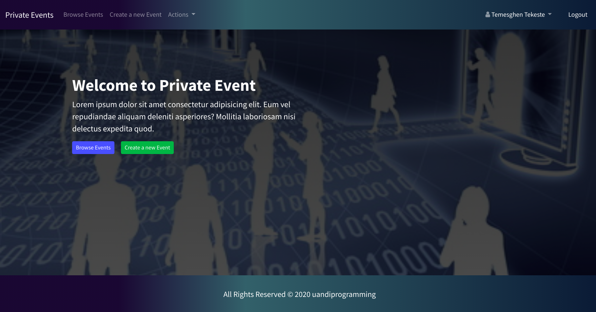
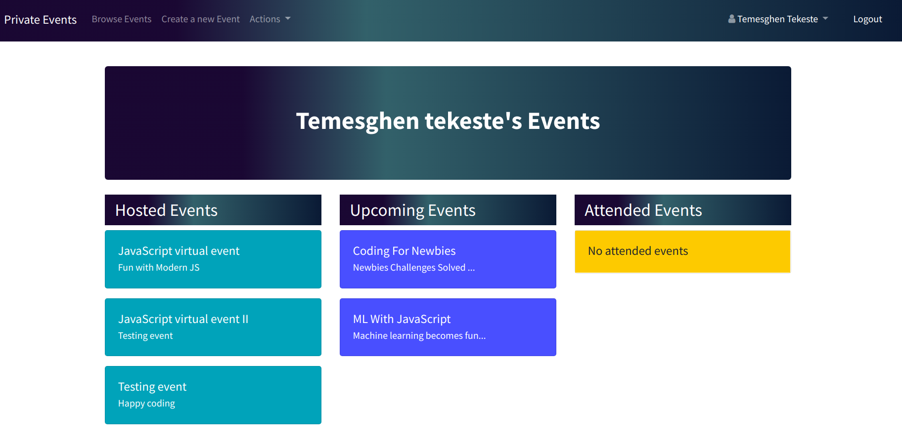
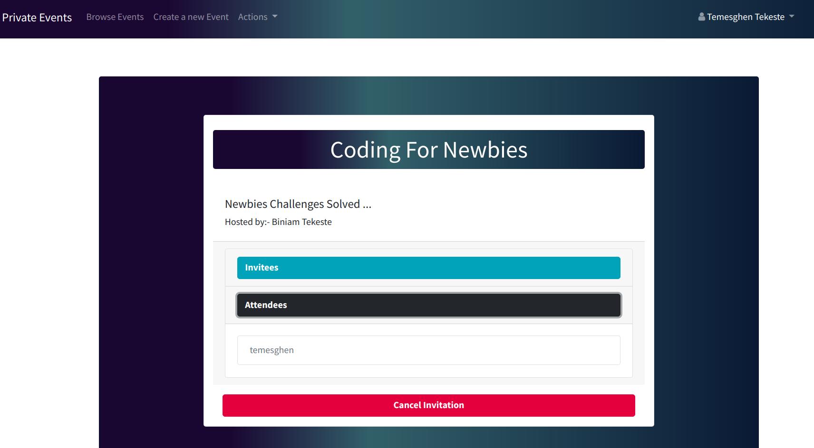

# Private Event

This project is a microverse solo project which is part of the requirements of the microverse main curriculum in the Rails section. The project is about building a site similar to eventbrite. It is intended as a learning project to showcase skills in the associations and testing feature of Ruby on Rails MVC framework. 

The authentication is done using the Devise gem and Bootsrap is used to style the views. The pagination is implemented using the kaminari gem. To implement testing RSpec and Capybara along with other supplementary gems are used.

In this project, signed in user can create a meeting and invite other users to attend the created meeting. The attendee has the power to accept or reject a particualr invitation. On the other hand, guest user are allowed only to see events in the site without creating one or sending an invitation to the users of the site. 

      

<div align="center">

[](https://github.com/temesghentekeste/private-event/tree/feature/private-event-logic)
[](https://github.com/temesghentekeste/private-event/issues)
[](https://github.com/temesghentekeste/private-event/pulls)

</div>

## 📝 Content

<p align="center">
<a href="#with">Built with</a>&nbsp;&nbsp;&nbsp;|&nbsp;&nbsp;&nbsp;
<a href="#live">Live Demo</a>&nbsp;&nbsp;&nbsp;|&nbsp;&nbsp;&nbsp;
<a href="#sc">Screenshots</a>&nbsp;&nbsp;&nbsp;|&nbsp;&nbsp;&nbsp;
<a href="#gs">Getting started</a>&nbsp;&nbsp;&nbsp;|&nbsp;&nbsp;&nbsp;
<a href="#author">Author</a>
</p>

## 🔧 Built with<a name = "with"></a>

- Ruby on Rails (Version: 6.0.3.2)
- Ruby (Version: 2.7.1)
- RSpec
- Capybara
- Shoulda Matchers
- Factory Bot Rails
- Faker
- Bootsrap 4.5.x
- Kaminari gem
- Devise gem
- PostgreSQL

## 🔴 Live Demo <a name = "live"></a>
*Click [here](https://private-events-temesghen.herokuapp.com) in order to see a Live Demo of this project.**


## Screenshots <a name = "sc"></a>






## Getting Started <a name = "gs"></a>

To get a local copy of the repository please run the following commands on your terminal:

```
$ git clone git@github.com:temesghentekeste/private-event.git
$ cd private-event
```
- Open the project in your favorite code editor
- Set database credentilas for PostgreSQL in config/database.yml file
~~~bash
$ bundle install
$ rails db:migrate  
~~~


## ✒️  Author <a name = "author"></a>

👤 **Temesghen Tekeste**

- Github: [@temesghentekeste](https://github.com/temesghentekeste)
- Twitter: [@temesghentekes1](https://twitter.com/temesghentekes1)
- Linkedin: [temsghen-tekeste-bahta-8b5243193](https://www.linkedin.com/in/temesghentekeste/)


## 🤝 Contributing

Contributions, issues and feature requests are welcome!

Feel free to check the [issues page](https://github.com/temesghentekeste/private-event/issues).


## 👍 Show your support

Give a ⭐️ if you like this project!

## :clap: Acknowledgements

- The Odin Project: [@theodinproject](https://www.theodinproject.com/)
- Microverse: [@microverse](https://www.microverse.org/)
